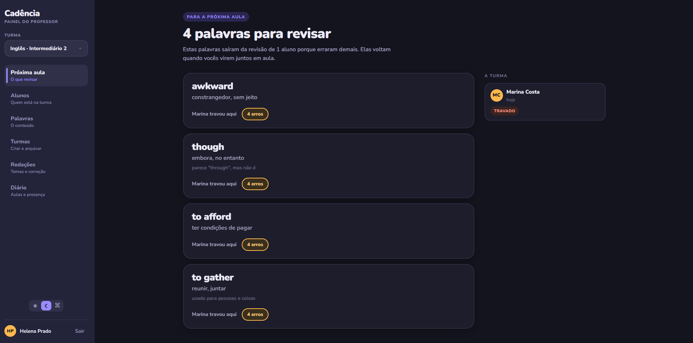
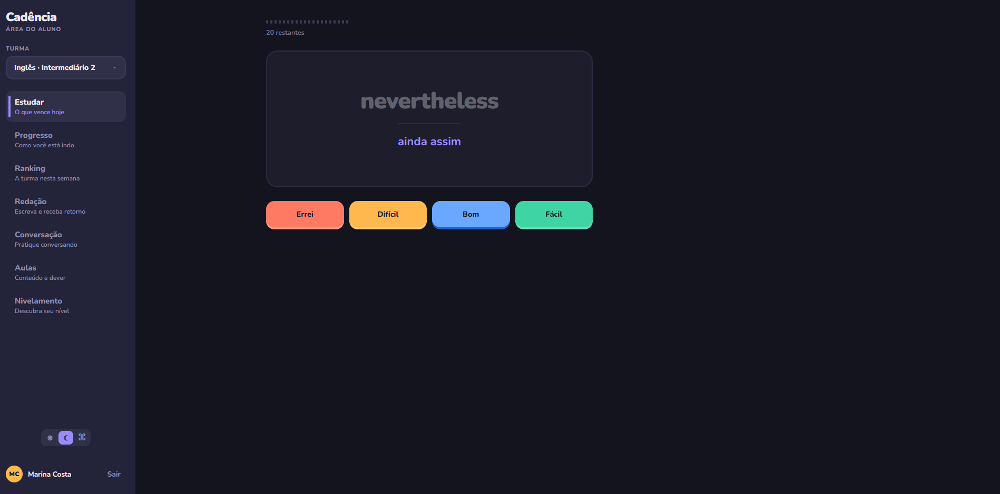
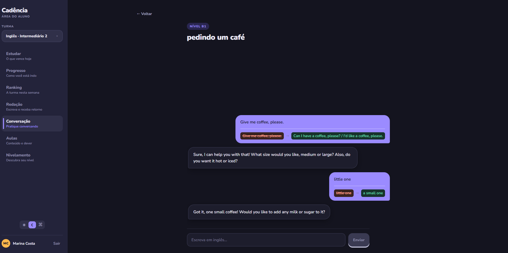
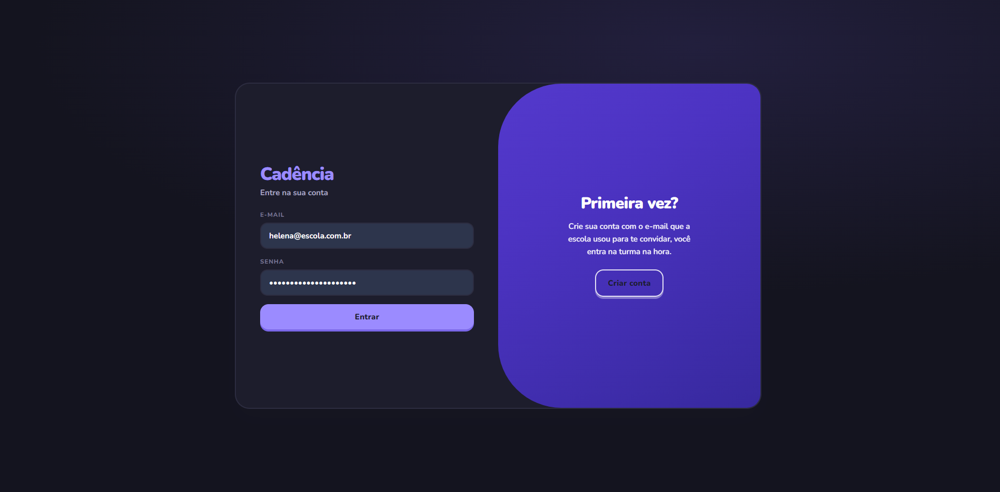

# Cadência

**Plataforma de estudo para escolas de idiomas.** O aluno revisa vocabulário com
repetição espaçada, descobre o próprio nível, escreve redações e pratica
conversação. O professor gerencia turmas e conteúdo, corrige redações, registra o
diário de classe e vê, antes da próxima aula, qual palavra travou.

Monorepo TypeScript com um domínio compartilhado entre o cliente e o servidor.



> O professor abre a plataforma e a primeira coisa que vê é o que precisa
> resolver na próxima aula.

|                   |                                                      |
| ----------------- | ---------------------------------------------------- |
| **Portal**        | React, Vite, TanStack Query                          |
| **API**           | Fastify, PostgreSQL, JWT com rotação                 |
| **IA**            | Gemini para correção de redação e conversação        |
| **Compartilhado** | Domínio puro, contratos em Zod, cliente HTTP         |
| **Qualidade**     | 356 testes unitários, 138 de integração, CI completo |

O app móvel vive em repositório separado: [cadencia-app](https://github.com/KarolNutty/cadencia-app).
Ele consome esta API e importa o mesmo `packages/dominio`.

```bash
npm install
cp .env.example .env          # gere os dois segredos
npm run banco:subir
npm run migrar && npm run semear

npm run api
npm run web
```

O `semear` cria a turma, 48 palavras de inglês, as perguntas de nivelamento e
**seis dias de histórico**: palavras travadas, aulas registradas, redação
entregue. Quem clona vê o produto com vida, e não seis telas vazias.

A chave do Gemini é opcional. Sem ela, a correção e a conversação usam um
provedor simulado, e o projeto roda por completo.

---

## O que a plataforma faz

### O aluno



Sessão de flashcards com repetição espaçada, teste de nivelamento adaptativo,
redação com análise instantânea, conversação com correção, pontuação com
ofensiva e ranking, aulas e frequência.

### Conversação com correção



O aluno escolhe uma situação e conversa. A correção vem presa à fala que a
gerou, e **fora do fio da conversa**: um parceiro que corrige dentro da resposta
quebra o assunto e para de conversar.

### A entrada



---

## A decisão que organiza o projeto

> **O mesmo código de agendamento roda no navegador e no servidor.**

Quando o aluno avalia uma carta, o próximo intervalo é calculado **no cliente**,
chamando o mesmo módulo que a API chama. A tela responde na hora, porque quem
avalia trinta cartas em três minutos não pode esperar a rede a cada uma. O
servidor recalcula ao receber o lote, e a resposta dele é a autoridade.

Como é o mesmo arquivo importado, e não a mesma regra escrita duas vezes, os
dois não têm como divergir. Há um teste comparando os resultados, e ele quebra o
build se alguém reimplementar a regra "só no cliente, para ser mais rápido".

```
apps/
├── api/          Fastify, Postgres, JWT
└── web/          React, Vite, portal do aluno e do professor
packages/
├── dominio/      repetição espaçada, nivelamento, pontuação, frequência
├── contrato/     schemas Zod: validam na API e tipam no cliente
├── cliente-api/  cliente HTTP com renovação de token coordenada
└── config/       validação de ambiente
```

O `dominio` não importa nada, nem contrato, nem framework, nem Zod. Uma regra de
ESLint quebra o build se alguém tentar. É isso que permite testá-lo em Node puro
e rodar o mesmo arquivo nos dois lados.

---

## Decisões de produto

### O dia vira às 4 da manhã, no fuso do aluno

Quem senta para estudar à uma da manhã ainda está no dia dele. Com o corte à
meia-noite, esse aluno **perderia a sequência por estar estudando**, que é o pior
incentivo possível.

Dia de estudo é data de negócio, não data de relógio. Os dois quase sempre
coincidem, e é por isso que a diferença passa despercebida até quebrar.

### O algoritmo cede ao calendário da escola

A base é o SM-2, do Anki. O que vale não é copiá-lo, é o que muda por causa do
domínio.

**Teto de 120 dias.** O SM-2 puro manda uma carta bem sabida para daqui a três
anos. Num curso de seis meses isso equivale a apagá-la.

**Errar não destrói a facilidade.** Sem um piso, um punhado de cartas difíceis
domina toda sessão e o aluno desiste. Passando de quatro erros, a carta é
sinalizada para o professor: o software admite que aquilo não é problema de
agendamento.

| Aluno         | Intervalos                                   |
| ------------- | -------------------------------------------- |
| Sempre acerta | 1, 3, 8, 20, 50, 120                         |
| Acha difícil  | 1, 3, 6, 11, 19, 30, 48                      |
| Carta travada | fica em 1 dia e sai da sessão no quarto erro |

### XP não se ganha por volume

Dar ponto por carta avaliada faria o aluno marcar "fácil" trinta vezes, liderar
o ranking sem estudar e, pior, aprender o comportamento que **destrói o próprio
agendamento**, porque marcar fácil no que não se sabe manda a carta para daqui a
dois meses.

O sistema de pontos não pode premiar o que o produto existe para evitar.

| Regra                        | Motivo                                                 |
| ---------------------------- | ------------------------------------------------------ |
| Só carta vencida rende ponto | Senão bastaria reabrir o baralho toda hora             |
| Errar não desconta           | Punir o erro empurra a marcar "bom" no que não se sabe |
| Teto diário                  | Sem ele o ranking mede tempo livre, não constância     |
| Ranking da semana            | Acumulado trava: quem entra depois nunca alcança       |

### O nivelamento converge, não cansa

Um teste fixo de sessenta perguntas mede tédio. O adaptativo escolhe a próxima
pela resposta anterior e para quando a incerteza cai. Oito perguntas bastam para
separar A2 de B1.

A confiança do resultado combina duas coisas: quão fechado ficou o intervalo e
**quão coerentes foram as respostas**. Só a largura não basta, porque quem
responde ao acaso pode fechar o intervalo por sorte e receber confiança máxima.

### A chamada nasce com todos presentes

O professor marca as exceções. Começar com todos ausentes obrigaria a marcar
trinta pessoas numa aula normal, e o esquecimento produziria falta em quem estava
lá, que é o erro mais caro dos dois.

Falta justificada não conta contra a taxa, **mas conta no total**. Tirá-la dos
dois lados faria quem faltou justificadamente dez vezes ter a mesma frequência de
quem nunca faltou, e a escola perderia de vista o aluno que está sumindo com
motivo.

---

## IA que não decide sozinha

Correção de redação e conversação usam o Gemini, com uma divisão de trabalho
fixa: **a IA analisa, o código verifica, o professor avalia.**

**Todo apontamento cita o trecho exato, e o servidor confere se ele existe no
texto.** Modelo de linguagem parafraseia sem perceber, e um apontamento que cita
trecho inexistente faz o aluno procurar, não achar e desconfiar do resto. Na
redação os não localizados vêm marcados e recolhidos, nunca escondidos, porque
esconder tiraria do professor a chance de ver o modelo alucinando.

**O modelo não conta palavras.** O código conta, com o mesmo módulo nos dois
lados. Pedir contagem a um LLM devolve "aproximadamente 150 palavras" para um
texto de 87, e o aluno acredita.

**O histórico da conversa vive no servidor.** O cliente manda só a mensagem
nova. Se mandasse o histórico, daria para reescrevê-lo pelo console e induzir o
modelo a sair do papel. Há teste mandando falas forjadas e conferindo que não
têm efeito.

**A chave nunca chega ao navegador**, vai no cabeçalho e não na URL, e é filtrada
das mensagens de erro por formato **e pelo valor em uso** — porque reconhecer
formato é frágil, e o formato seguinte nunca está na lista.

**O modelo é configurável.** Provedores aposentam modelo sem aviso, e quando isso
acontece a correção não deveria exigir mexer no código e publicar de novo.

---

## Segurança

O sistema **não é impenetrável**. Nenhum é, e anunciar isso costuma indicar que
ninguém auditou. O que existe é um modelo de ameaças, um controle para cada uma e
um teste provando que o controle funciona. Onde a defesa termina também está
registrado: [`docs/seguranca.md`](docs/seguranca.md).

**Autorização por recurso, não só por papel.** O aluno troca o id na URL e vê o
progresso do colega. Não exige ferramenta nenhuma, e o endpoint "funciona", por
isso não aparece em revisão apressada. Toda consulta filtra pelo id **do token**,
e recurso alheio responde **404, não 403**: um 403 confirmaria que o registro
existe, permitindo mapear a base variando o id.

**Renovação rotativa com detecção de reúso.** Cada token de renovação vale uma
vez. Se um já usado reaparece, ou vazou ou houve corrida, e nos dois casos a
família inteira cai. Isso transforma um roubo silencioso de trinta dias num
logout que a pessoa percebe.

**No navegador o token de renovação vive em cookie `httpOnly`**, e o de acesso
só em memória. Ao recarregar a página, o app troca o cookie por um acesso novo.
Sem esse passo, a escolha correta custaria um logout a cada F5, e alguém acabaria
movendo o token para `localStorage` "porque estava deslogando".

**Limite de requisição por conta, não por endereço.** Numa escola com rede
compartilhada, a cota por IP é consumida pela turma e a última pessoa a usar fica
bloqueada pelos colegas.

**Quem se cadastra é sempre aluno.** O papel não vem do formulário. Há teste
mandando `papel: "professor"` no corpo e conferindo que sai `aluno`.

**Nenhum segredo no repositório.** A aplicação valida o ambiente na partida e
recusa subir com segredo ausente, curto, copiado do exemplo ou sem entropia. O
modo mais comum de vazamento não é o segredo commitado, é o ausente virando
`?? 'dev'` e passando meses assinando token sem ninguém notar.

---

## Testes

**356 unitários e 138 de integração** contra Postgres real.

| Camada     | Como                                                              |
| ---------- | ----------------------------------------------------------------- |
| `dominio`  | Node puro. O valor esperado é calculado fora do código testado    |
| `contrato` | O que a API precisa recusar antes de tocar no banco               |
| `api`      | Postgres de verdade em Docker, o mesmo motor de produção          |
| `web`      | Testing Library: ordem da lista, rótulos, teclado, acessibilidade |

Duas suítes separadas: `npm test` roda em segundos sem Docker,
`npm run test:integracao` exige o banco. Misturar faria quem não tem Docker ver
vermelho num código correto, e o hábito que nasce daí é ignorar teste vermelho.

### O que o pipeline barra

Roda a cada push e pull request, e impede o merge em qualquer destes casos:

| Barra quando                                   | Passo                      |
| ---------------------------------------------- | -------------------------- |
| Um tipo não fecha em qualquer dos projetos     | `typecheck`                |
| Qualquer regra de lint quebra, inclusive aviso | `lint --max-warnings 0`    |
| Um arquivo sai do padrão de formatação         | `format:check`             |
| Um teste falha, com ou sem banco               | `test` e `test:integracao` |
| O portal não compila                           | `build:web`                |
| Um segredo aparece no código ou no histórico   | `gitleaks`                 |
| Há vulnerabilidade alta ou crítica             | `npm audit`                |

O Postgres sobe como serviço do próprio job. Sem isso, os testes que provam a
autorização por recurso e a rotação de token não rodariam, e um pull request que
quebrasse qualquer um deles passaria verde. **Teste que só roda na máquina de
quem escreveu não protege nada.**

O `gitleaks` varre o histórico completo, não só o último commit: segredo que já
entrou no passado não sai com um commit de remoção.

---

## Erros que os testes encontraram

Ficam aqui porque são a parte mais útil deste documento.

**Uma verificação de segurança que nunca disparava.** A lista de segredos óbvios
comparava por igualdade exata, e como todos os itens têm menos de 32 caracteres,
a regra de tamanho já os barrava antes. Era código morto se passando por
controle. O caso real não é usar exatamente `changeme`, é pegar `changeme` e
completar até passar no mínimo.

**Um teste medindo a camada errada.** Eu afirmava que o campo `tipo` impedia usar
um token de renovação como acesso. O teste passava, mas porque a assinatura já
reprovava antes, já que os segredos são diferentes. A segunda barreira nunca era
exercitada.

**Um limite de tentativas que degenerou em silêncio.** A chave juntava IP e
e-mail, mas era calculada antes de o corpo ser lido, então virava só o IP. Cinco
tentativas erradas de uma pessoa bloqueariam o login de todos atrás do mesmo
endereço. O teste que existia contava tentativas de uma conta só, e passaria
mesmo com o defeito.

**Um bug que só aparecia à noite.** O painel calculava "hoje" uma vez, no fuso do
servidor. Rodando às onze da noite no Brasil, já dia seguinte em UTC, a regra das
4h jogava o dia para trás e quem tinha acabado de estudar aparecia com sequência
zero.

**Uma busca que não convergia.** No nivelamento, errar em X mantinha X no
intervalo, e o aluno de A2 oscilava entre A2 e B1 até o limite de perguntas.
Errar em X significa "abaixo de X".

**Duas pontas testadas que não se encontravam.** O servidor tinha teste provando
que o modo `web` devolve cookie e o modo `mobile` devolve corpo. O cliente tinha
teste provando que renova ao tomar 401. Os dois passavam, e o painel deslogava a
cada recarregamento: o cliente pedia o modo errado, e nenhum teste olhava para a
combinação. Pior, o token de renovação chegava ao navegador no corpo, exatamente
o que o `httpOnly` existe para impedir.

O padrão é o mesmo, e é a lição que eu levo do projeto:

> **Comentário não é executável.** Em vários casos existia um comentário
> afirmando uma garantia que o código não entregava. Toda afirmação de garantia
> precisa de um teste que falharia sem ela, e o teste precisa ser capaz de falhar
> pelo motivo certo.

E dois corolários que custaram repetição:

> **Corrigir uma ocorrência não cria a regra.** O limite por endereço foi
> implementado errado duas vezes, no login e na redação, antes de virar um módulo
> compartilhado.

> **Testar as pontas separadamente não prova que elas se encontram.**

---

## Documentos

- [`docs/arquitetura.md`](docs/arquitetura.md), organização e o que fica compartilhado
- [`docs/seguranca.md`](docs/seguranca.md), modelo de ameaças, controles e limites
- [`docs/commits.md`](docs/commits.md), convenção de commits

## Licença

MIT
